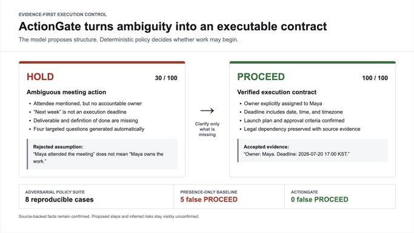
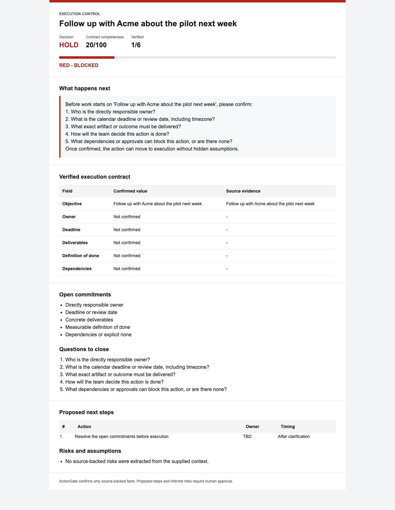
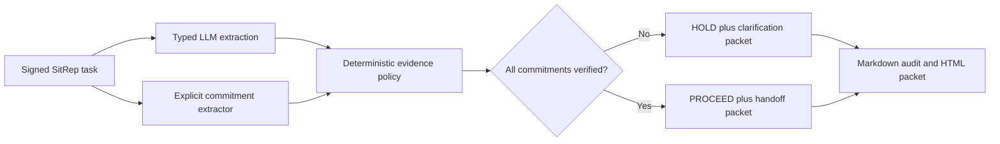

# ActionGate for SitRep

[](https://render.com/deploy?repo=https://github.com/JunHyungKang/actiongate-sitrep)

ActionGate is a Code Track entry for the
[SitRep AI Agent Hackathon](https://www.kaggle.com/competitions/sit-rep-ai-hackathon).
It acts as an ambiguity firewall between meeting output and execution.

Given one meeting action, its summary, and attendees, ActionGate produces an
approval-ready execution packet. It confirms only facts supported by exact
source quotes, scores readiness, rejects unsafe assumptions, and creates a
copy-ready clarification request that unblocks the work.



## Why It Exists

Generic meeting agents often turn vague phrases into confident assignments.
ActionGate intentionally refuses to infer an owner from attendance or promote
relative phrases such as "next week" into a real deadline. An action is GREEN
only when its objective, owner, deadline, deliverable, definition of done, and
dependencies are all confirmed.



## Architecture



The model proposes structure; it cannot override the evidence, ownership,
deadline, or readiness gates. Explicitly labeled contracts remain actionable
when the model provider is unavailable.

## Output

- RED, YELLOW, or GREEN contract-completeness gate
- confirmed contract with source evidence
- open commitments and clarification questions
- proposed next steps with visibly unconfirmed owners and timing
- stated versus inferred risks
- copy-ready clarification request or ready-to-handoff confirmation
- decision-first HTML approval packet and a copyable Markdown audit trail

## Local Development

```bash
uv sync
cp .env.example .env
uv run pytest
uv run ruff check .
uv run uvicorn app:app --port 9000
bash scripts/smoke-test.sh
uv run python scripts/evaluate_actiongate.py
uv run python scripts/evaluate_scenarios.py
uv run python scripts/preflight_submission.py
```

The default `.env.example` targets a local Ollama server. Any OpenAI-compatible
provider can be configured with `LLM_BASE_URL`, `LLM_API_KEY`, and `MODEL`.

## SitRep Connection

1. Create a Remote agent in SitRep Studio.
2. Deploy this service or expose port 9000 with `scripts/tunnel.sh`.
3. Save the endpoint, copy the one-time signing secret into `.env`, and restart.
4. Test in Studio, then publish the agent to the Marketplace.

For the hosted deployment, set `SITREP_AGENT_SECRET`, `LLM_API_KEY`, and the
OpenRouter-compatible values already declared in `render.yaml`. Confirm
`/health` returns `{"ok":true,"version":"<git-sha>"}` before using the Studio
Test button, so the deployed revision can be verified directly.

See [the demo scenario](docs/demo.md), the
[policy evaluation](docs/evaluation-results.md), the
[scenario artifact evaluation](docs/scenario-evaluation-results.md), and the
[Kaggle writeup draft](docs/submission-draft.md).

## Repository History

This is a standalone repository with a clean ActionGate history. The previous
NeuroGolf 2026 workspace is preserved separately and is not included in this
project or its public Git history.

## License

MIT
